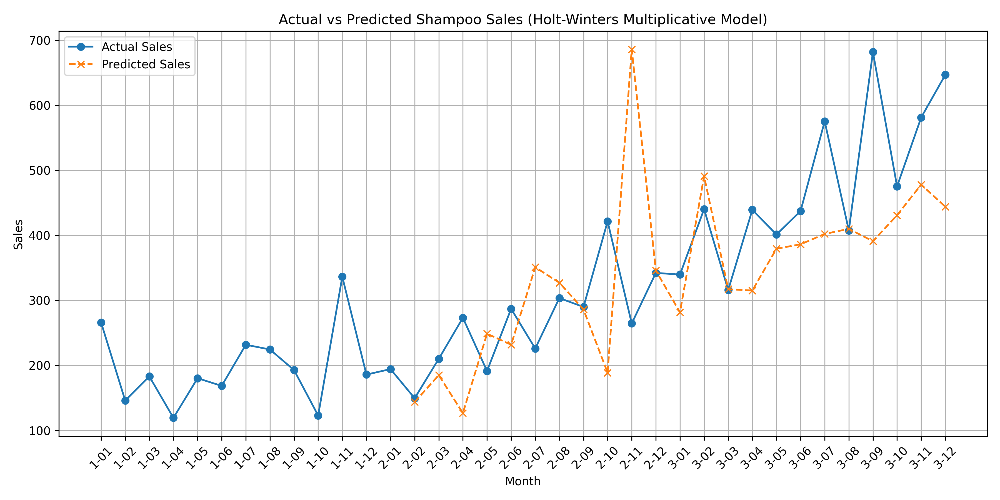

# Holt-Winters Exponential Smoothing from Scratch for Shampoo Sales Prediction

🚀 A **manual implementation** of Holt-Winters Exponential Smoothing (Multiplicative Model) to forecast shampoo sales data, built **from scratch** based on academic research papers.

---

## 📖 Project Description

This project applies the **Holt-Winters Exponential Smoothing** method to predict monthly shampoo sales using a **custom-built** model.  
Rather than using existing machine learning libraries, the model is built **manually from scratch**, based on mathematical formulas and concepts detailed in academic research papers on time series forecasting.

---

## 📂 Dataset

- **Source:** Provided in `shampoo_sales.csv`
- **Features:**
  - `Month`: Month identifier (e.g., "1-01", "1-02")
  - `Sales`: Monthly sales volume

Example:

| Month | Sales |
|:-----:|:-----:|
| 1-01  | 266.0 |
| 1-02  | 145.9 |

---

## ⚙️ Methods Used

- Manual computation of:
  - **Level component** (`l0`)
  - **Trend component** (`t0`)
  - **Seasonality component**
- Application of **Holt-Winters Exponential Smoothing (Multiplicative Seasonality)** model manually.
- Data visualization using **Matplotlib**.

---

## 🛠️ Tech Stack

- Python 3
- Pandas
- Numpy
- Matplotlib

---

## 🎯 Key Highlights

✅ Manual coding of Holt-Winters model without using prebuilt machine learning libraries.  
✅ Translation of theoretical concepts and mathematical formulas into working Python code.  
✅ Hands-on experience in reading, understanding, and applying academic research.

---

## 📈 Result

- Visual representation of real sales data vs predicted values.
- Effective capture of trend and seasonality over time.

> 📷 Result Visualization


---

## 📋 How to Run

1. Clone this repository:
    ```bash
    git clone https://github.com/your-username/holt-winters-shampoo-sales.git
    cd holt-winters-shampoo-sales
    ```
2. Install the required libraries:
    ```bash
    pip install pandas numpy matplotlib
    ```
3. Run the script:
    ```bash
    python holt-winter_exponential_smoothing_multiplicative.py
    ```

---

## 🧠 Lessons Learned

- How to translate mathematical models into actual code.
- Deep understanding of smoothing methods for time series data.
- Importance of trend and seasonality in forecasting.

---

## 📜 License

This project is licensed under the MIT License.

---

## 🙌 Acknowledgements

- Academic papers and research materials on Holt-Winters Exponential Smoothing methodology.

---

## 📢 Notes

If you are interested in understanding time series forecasting deeply, implementing models manually without relying on prebuilt libraries is a highly recommended learning path.

---
